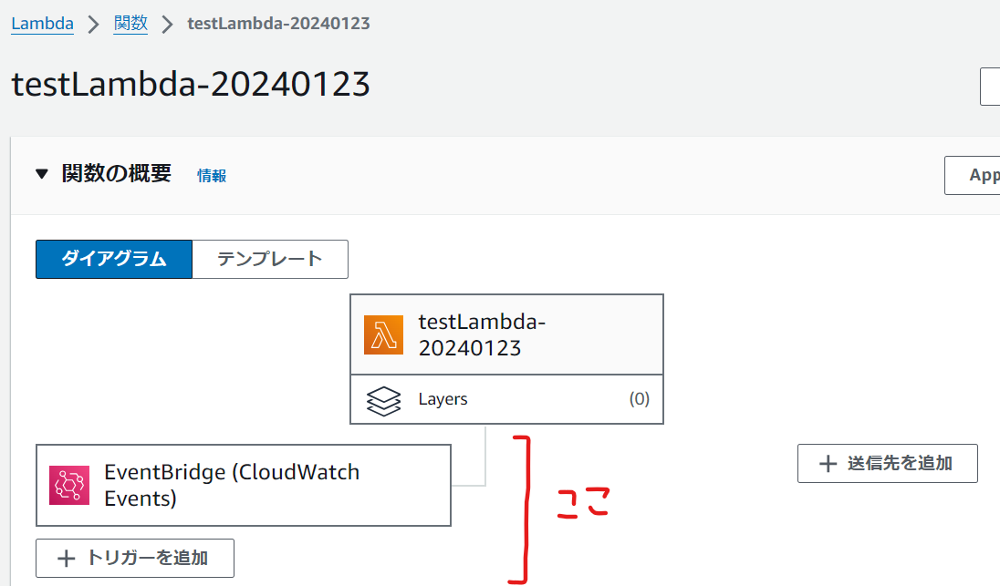

- [概要](#概要)
  - [No.1 : AWSコンソール上でEventBridgeとLambdaを関連付けるとLambdaリソースポリシーが自動更新される](#no1--awsコンソール上でeventbridgeとlambdaを関連付けるとlambdaリソースポリシーが自動更新される)
  - [No.2 : Lambdaリソースポリシーのサイズ上限は20kb](#no2--lambdaリソースポリシーのサイズ上限は20kb)
  - [No.3 : Lambda関数の概要でトリガーとして表示されるリソース/表示されないリソース](#no3--lambda関数の概要でトリガーとして表示されるリソース表示されないリソース)
  - [No.4 : AWS CLIやAWS SDKでEventBridgeとLambdaを関連付ける場合はLambdaのリソースポリシーが自動更新されない](#no4--aws-cliやaws-sdkでeventbridgeとlambdaを関連付ける場合はlambdaのリソースポリシーが自動更新されない)
  - [No.5 : AWS CLIでEventBridgeとLambdaを関連付ける際の手順](#no5--aws-cliでeventbridgeとlambdaを関連付ける際の手順)

# 概要
EventBridgeでLambdaを発火させる際の知っておくと役立つかもしれないネタを整理する。

## No.1 : AWSコンソール上でEventBridgeとLambdaを関連付けるとLambdaリソースポリシーが自動更新される

AWSコンソール上でEventBridgeとLambdaを関連付けると、必要最低限の権限が記述されたポリシーステートメントがLambdaリソースポリシーに自動追加される。
自動追加されるポリシーステートメントは下記のとおりで、トリガーとなるEventBridgeに対してターゲットとなるLambdaを呼び出す事を許可する内容となっている。

<details><summary>自動追加されるポリシーステートメント</summary>

```
{
  "Sid": "AWSEvents_testEventRule2_Id2c05b682-7776-48ed-a613-c2a60e06dcdb",
  "Effect": "Allow",
  "Principal": {
    "Service": "events.amazonaws.com"
  },
  "Action": "lambda:InvokeFunction",
  "Resource": "arn:aws:lambda:ap-northeast-1:<アカウントID>:function:testLambda-20240123",
  "Condition": {
    "ArnLike": {
      "AWS:SourceArn": "arn:aws:events:ap-northeast-1:<アカウントID>:rule/testEventRule2"
    }
  }
}
```
</details>

（裏で自動追加してくれるため意識しにくいが、）EventBridgeRuleでLambdaを発火させるためには、LambdaリソースポリシーにてEventBridgeに対する「lambda:InvokeFunction」アクションを許可する必要がある。

## No.2 : Lambdaリソースポリシーのサイズ上限は20kb

[No.1](#no1-awsコンソール上でeventbridgeとlambdaを関連付けるとlambdaのリソースポリシーが自動追加される)に記載した通り、AWSコンソール上でEventBridgeとLambdaを関連付けるとLambdaリソースポリシーにポリシーステートメントが自動追加される。  
LambdaのトリガーとするEventBridgeが多い場合、自動追加されるポリシーステートメントによってLambdaリソースポリシーのサイズが大きくなる。サイズ上限を向かえる都合により、これ以上ポリシーステートメントを自動追加できない状況となった場合、エラーとなりEventBridgeとLambdaを関連付けられなくなる。  
Lambdaリソースポリシーがサイズ上限になったが、トリガーとなるEventBridgeはまだあるという場合、Condition条件を少し緩めたポリシーステートメントを設定して他のポリシーは全削除する等で対処可能。

<details><summary>Condition条件を少し緩めたポリシーステートメント</summary>

```
{
  "Sid": "<任意の文字列>",
  "Effect": "Allow",
  "Principal": {
    "Service": "events.amazonaws.com"
  },
  "Action": "lambda:InvokeFunction",
  "Resource": "arn:aws:lambda:ap-northeast-1:<アカウントID>:function:<Lambda関数名>",
  "Condition": {
    "ArnLike": {
      "AWS:SourceArn": "arn:aws:events:ap-northeast-1:<アカウントID>:rule/*"
    }
  }
}
```
</details>

## No.3 : Lambda関数の概要でトリガーとして表示されるリソース/表示されないリソース
Lambdaコンソールは、Lambda関数に設定されたリソースポリシーの内容をもとに、トリガーの情報を取得して表示するという動作をする。  
そのため、[No.2](#no2--lambdaリソースポリシーのサイズ上限は20kb)の最後に記載したように、特定のEventBridgeRuleがCondition句によって指定されていない場合、トリガーとなるEventBridgeRuleを特定できず、Lambdaコンソールに表示されない。  
ただし、Lambdaコンソールに表示されないものの、EventBridgeRuleによるLambdaの呼び出しは許可されており、動作上問題ない。



## No.4 : AWS CLIやAWS SDKでEventBridgeとLambdaを関連付ける場合はLambdaのリソースポリシーが自動更新されない
某案件対応中にAWSサポート問い合わせし、AWS CLIやAWS SDKでEventBridgeとLambdaを関連付ける場合はLambdaのリソースポリシーが自動更新されない旨の回答を得た。  
AWS CLIの場合、`aws events put-target`を使用し、EventBridgeとLambdaの関連付け時にLambdaリソースポリシーが自動更新されないことを確認した。  
AWS SDKの場合、`PutTargetsCommand`を使用するものと思われるが、未確認。  

## No.5 : AWS CLIでEventBridgeとLambdaを関連付ける際の手順
訳あってEventBridgeをTerraform管理外リソースとする場合を想定。
<details><summary>※某案件の場合、下記理由によりTerraform管理外とした。</summary>

- 月次バッチを毎月第2営業日に実施したいとの要望あり
- 第2営業日が月ごと年ごとに変わるため、EventBridgeは複数必要
- Lambdaへの入力が異なるため、サービスを利用するお客様ごとにEventBridgeが必要
- 月ごとにEventBridgeを用意すると`12 × <お客様数>`のEventBridgeが必要となり、今後お客様が増えていく事を考慮すると好ましくない  
  -> 第2営業日が同じ日になる月は1つのEventBridgeにまとめる方針となった  
     例えば2023年の5月、6月、8月、11月は第2営業日が2日だったため、下記cronでまとめた。  
     `cron(0 2 2 5,6,8,11 ? 2023)`  
- 第2営業日が同じ日になる月の組み合わせも年毎に代わり、もうTerraform管理外でよいとなった。

</details>

以下、2パターン記載するが、いずれもEventRule自体は作成済みであることを前提とする。  

- パターン1 : Lambdaへの入力JSONは、ローカルに保存したファイルを利用  
  1. ローカルに下記のようなJSONファイルを作成  
      ```
      [
        {
          "Id":"testLambda-20240123",
          "Arn":"arn:aws:lambda:ap-northeast-1:xxxxxxxxxxxx:function:testLambda-20240123",
          "Input":"{\"bizLogic\":\"plannedStartStop\",\"args\:"{\"service\":\"EC2\",\"action\":\"start\",\"targets\":{\"targetsIds\":\"xxxxxxxxxx\"}}}"
        }
      ]
      ```
  2. PowerShellで下記コマンドを実行  
      ```
      # JSONファイルを格納したディレクトリへ移動
      cd xxx/xxx/

      # EventRuleにターゲット登録
      aws events put-targets --rule "testEventRule" --targets file://xxxxx.json
      ```
  3. エラー無くコマンドが完了したことを確認し、AWS環境で確認  
      [1.]の内容のJSONの場合、Lambda関数「testLambda-20240123」に対し下記入力が設定される  
      ```
      {
        "bizLogic": "plannedStartStop",
        "args": {
          "service": "EC2",
          "action": "start",
          "targets": {
            "targetsIds": "xxxxxxxxxx"
          }
        }
      }
      ```

- パターン2 : Lambdaへの入力JSONは、AWS CLIのコマンドに直書き  
  1. PowerShellで下記コマンドを実行  
      ```
      # EventRuleにターゲット登録
      aws events put-targets --rule "testEventRule" --targets '[{"Id":"testLambda-20240123","Arn":"arn:aws:lambda:ap-northeast-1:xxxxxxxxxxxx:function:testLambda-20240123","Input":"{\"bizLogic\":\"plannedStartStop\",\"args\":{\"service\":\"EC2\",\"action\":\"start\",\"targets\":{\"targetsIds\":\"xxxxxxxxxx\"}}}"}]'
      ```
  2. エラー無くコマンドが完了したことを確認し、AWS環境で確認  
      パターン1と同じ結果が得られる。  
